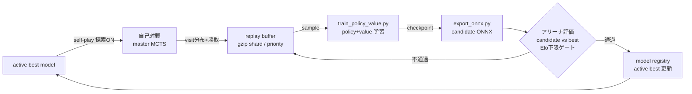

# 学習ワークフロー（人が見てわかる版）

「何を・どの順で・どこに出力して・どう確認するか」を一枚で追えるようにしたものです。
- コマンドの全オプション → [TRAINING_OPTIONS.md](TRAINING_OPTIONS.md)
- 手順の詳細 → [TRAINING_RUNBOOK.md](TRAINING_RUNBOOK.md)
- 全体設計 → [ARCHITECTURE.md](ARCHITECTURE.md)
- 現状評価とロードマップ → [EVALUATION.md](EVALUATION.md)

---

## 全体像（AlphaZero ループ）



要点（[EVALUATION.md](EVALUATION.md) の修正を反映）:
- 自己対戦は **MCTS 内で探索**する（Dirichlet root noise ＋ visit 分布の温度サンプリング）。着手が探索の一部のままなので **visit 分布の policy 教師が有効**。
- value 教師は **勝敗(win/loss)**。
- **Bootstrap**: active best が無い初回は candidate を best-0 として seed（以降は best 超えを要求）。「永遠に昇格しない」停滞を回避。
- 昇格判定は **Elo下限（既定 40局・下限+10）** または **SPRT**（`--gate-mode sprt`、多反復で効率的）。
- **再開**: 各反復で `loop-state.json` を更新。中断後は `--resume` で続きから（registry/buffer はディスク永続）。長時間ランは `[iter N/M] …` 行で進捗を追える。

---

## 1 回の学習でどこに何が出るか（出力レイアウト）

散らからないよう、出力先を用途別に固定しています。

| 種別 | 置き場所 | git |
| --- | --- | --- |
| 反復学習の成果物（dataset/checkpoint/candidate/レポート） | `training/runs/<kind>/<timestamp>/`（`alphazero` / `selfplay` / `cycle`） | ignore |
| スモーク・お試し（`smoke:*`） | `training/.scratch/<preset>/` | ignore |
| 永続状態：リプレイバッファ | `training/replay_buffer*/` | ignore |
| 永続状態：モデルレジストリ／best | `training/model_registry*/`, `training/models/` | ignore |
| 公開モデル（ブラウザが読む） | `apps/web/public/models/*.onnx` | **commit** |
| JSONL 索引キャッシュ | `training/cache/`, `*.idx.*` | ignore |

- **スモークは公開モデルを上書きしません**（`training/.scratch/` に書き出す）。公開モデルを差し替えるのは、納得のいく候補を `export:onnx:pv -- --out apps/web/public/models/...` で明示出力したときだけ。
- 古い散らかりを消すには（ignore 済みなので git からは消えない）: `git clean -ndX training/`（プレビュー）→ `git clean -fdX training/`。

---

## 学習の様子を見る（ターミナルビューア）

`npm run view:selfplay` で 14×14 盤面をターミナルに描画し、AI が打つ様子を 1 手ずつ確認できます。

```bash
# master(ONNX) 対 expert を、1手あたり最大400ms・描画間隔350msで観戦
npm run view:selfplay -- --black-ai master --white-ai expert --teacher-ms 400 --delay-ms 350

# 速く流し見（遅延0・手数上限）
npm run view:selfplay -- --black-ai expert --white-ai normal --delay-ms 0 --max-moves 30

# 保存した棋譜(JSON)を再生
npm run view:selfplay -- --replay training/runs/.../game.json

# 学習メトリクスの推移を要約（loss/accuracy のスパークライン付き）
npm run view:selfplay -- --summary training/.scratch/smoke-learning/policy-value/train_summary.json
```

各手に `player / piece@(x,y) / value / sims / engine / score` を表示。最後に置いたピースは `▣`、開始マスは `✦` で示します。

---

## ネット規模の選び方（`--net-size`）

| preset | trunk | params(policy-value) | 用途の目安 |
| --- | --- | ---: | --- |
| `small` | 64ch × 4block | ~0.34M | スモーク・CI・既定。学習が速い |
| `medium` | 128ch × 10block | ~3M | ブラウザ推論も現実的。中間 |
| `large` | 256ch × 20block | ~24M | **強さ優先の目標**。ブラウザ推論レイテンシは要検証 |

```bash
npm run train:policy-value -- --dataset <data> --net-size large --epochs 20 --batch-size 4096
```

- `--channels` / `--residual-blocks` を明示すると preset を上書きできる（custom）。
- checkpoint に `model_arch` を記録するので `export:onnx` は同じ次元で自動復元。
- **大型ネットはブラウザ（onnxruntime-web）推論が重い**。`master` を実用速度で回すには、推論の高速化（leaf バッチ・マルチスレッド）か、ネイティブ自己対戦（[NATIVE_SELFPLAY.md](NATIVE_SELFPLAY.md)）が前提。まずは large を学習資産として育て、ブラウザ提供は別途検証する方針。

---

## 本格学習の始め方（`train:full`）

「準備が整ったら、これを回すだけ」の入口。2 フェーズを 1 つの registry / replay buffer / report に対して自動で回します。

```bash
npm run train:full -- --smoke    # まず全経路のドライラン（数分）。warm-up→bootstrap→main→SPRT→resume を検証
npm run train:full               # 本番（large ネット・GPU・多反復・SPRT・resume 対応）
npm run train:full -- --resume   # 中断した本番を続きから
```

- **Phase 1（コールドスタート warm-up）**: 旧変種の無効モデルを使わず、**強い探索 AI（expert_plus）の自己対戦**で初期データを作り、最初のネットを best-0 として bootstrap。
- **Phase 2（自己対戦）**: best から master 自己対戦（Dirichlet＋温度）で反復し、**SPRT ゲート**で昇格。`--resume` で再開可能。
- 出力は `training/runs/full/`（best は `model_registry/`）。進捗は `[iter N/M] …` 行と `npm run view:selfplay -- --summary <…>/train_summary.json`。
- 主要な上書き: `--net-size` `--iterations` `--warmup-iterations` `--workers` `--games` `--epochs` `--evaluation-games` `--teacher-ms` `--base-dir`（全フラグは [TRAINING_OPTIONS.md](TRAINING_OPTIONS.md)）。
- 納得のいく best が出たら公開モデルへ反映: `npm run export:onnx:pv -- --checkpoint <…/policy_value_best.pt> --out apps/web/public/models/blokus_policy_value.onnx`。

### 推論バックエンド（自己対戦の速度）

ローカルの自己対戦/学習は **ネイティブの `onnxruntime-node`** を自動検出して使います（WASM 比 **約3.5倍速**、大型ネットでは差はさらに拡大）。`onnxruntime-node` は `optionalDependencies`（`npm install` で自動導入。未導入環境では `onnxruntime-web` に自動フォールバック）。

```bash
BLOKUS_ORT_BACKEND=node   # 強制ネイティブ（既定 auto は node→web の順に試行）
BLOKUS_ORT_BACKEND=web    # WASM 強制
```

> さらに上のスループットは Rust ネイティブエンジン（[NATIVE_SELFPLAY.md](NATIVE_SELFPLAY.md)）。ローカルで `cargo test` を通せば解禁。

## クイックスタート

### A. まず最小スモーク（数分・CPU）
```bash
npm run smoke:learning -- --cpu     # dataset生成→policy/policy-value学習→ONNX出力（すべて .scratch/）
npm run view:selfplay -- --summary training/.scratch/smoke-learning/policy-value/train_summary.json
```

### B. 学習ループを 1 反復（公式ルール・探索ON・既定 small）
```bash
npm run alphazero:loop -- --iterations 1 --workers 4 --games 40 --epochs 2 --evaluation-games 40 --cpu
# 出力: training/runs/alphazero/<timestamp>/ , best は training/model_registry/
```

### C. 本格運用に向けて（大型ネット）
```bash
npm run alphazero:loop -- --iterations N --workers 8 --games 200 \
  --net-size large --epochs 20 --batch-size 4096 \
  --evaluation-games 200 --root-dirichlet-weight 0.25 --mcts-sampling-temperature 1.0
```
※ 計算量が大きいので GPU 前提。詳細フラグは [TRAINING_OPTIONS.md](TRAINING_OPTIONS.md)。

---

## 公開モデルの更新（ブラウザへ反映）

納得のいく candidate を選んだら、明示的に公開モデルへ出力します（ルール/encoder を変えた後は必須）。

```bash
npm run export:onnx:pv -- --checkpoint <runs/.../policy_value_best.pt> --out apps/web/public/models/blokus_policy_value.onnx
npm run verify   # build smoke 込みで確認
```

> ⚠️ 開始マスを公式 `(4,4)/(9,9)` に変更したため、それ以前の ONNX は無効。公開モデルは再学習→再 export で更新すること（[EVALUATION.md](EVALUATION.md)）。
